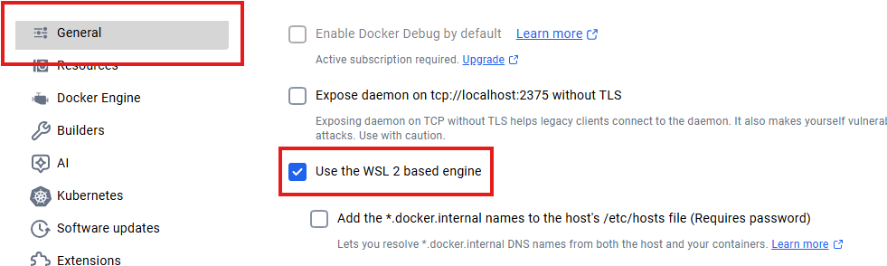
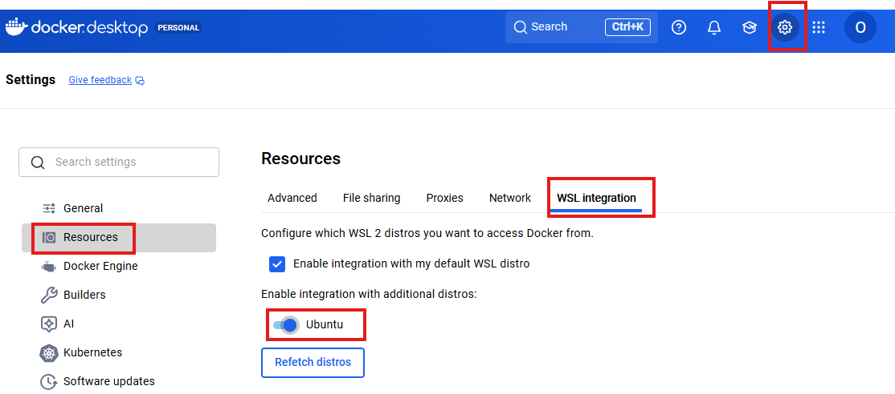

# Installazione Dev Containers

### Estensioni di VS CODE necessarie:
***Dev Containers***<br>
    Permette di utilizzare i dev containers tramite Docker, un ambiente di sviluppo **replicabile**; quando si utilizza un dev container, non è necessario<br>

***Wsl***<br>
    Permette di eseguire una distribuzione Linux senza una VM<br>

***Containers Tools***<br>
    Sostituisce la vecchia estensione *docker*

***Remote Explorer***<br>
    Permette di gestire e vedere tutte le destinazioni remote in un unico posto;<br>

***Remote Tunnels***<br>
    Puoi entrare ocunque nella tua macchina **senza configurare** SSH o aprire porte tramite tunnel sicuro.  

### Accorgimenti iniziali
1. Aggiornare powershell:
    ```
    winget install --id Microsoft.PowerShell --source winget
    ```

### Setup Docker Desktop (engine v28.4.0+)
1. Installa [**Docker desktop**](https://www.docker.com/) 

2. Aggiorna WSL (Subsystem Linux per Docker) inserendo da linea di comando con permessi di amministratore:
    ```
    wsl.exe --update
    ```

3. Abilitare su Docker nei setting generali "Use the WSL 2 based engine"
     

4. Assicurati di non avere più WSL installati:
    ```
    wsl --list --verbose
    ```
    in caso di installazione pulita sarà presente solo "docker-desktop"; se sono presenti più wsl installati, selezionare come principale quello appena installato:

    ```
    wsl --set-version <DistroName> 2
    ```

5. Imposta la versione 2 di WSL come default
    ```
    wsl --set-default-version 2
    ```

### Setup Docker WSL (Ubuntu 24.04.1 LTS)
1. Installa [**Ubuntu, Microsoft Store**](https://apps.microsoft.com/detail/9PDXGNCFSCZV?hl=neutral&gl=IT&ocid=pdpshare)

2. Assicurati di non avere più WSL installati:
    ```
    wsl --list --verbose
    ```
    in caso di installazione pulita sarà presente solo "docker-desktop"; se sono presenti più wsl installati, selezionare come principale quello appena installato:

    ```
    wsl --set-version <DistroName> 2
    ```

3. Una volta installato Ubuntu utilizza il comando
    ```
    docker --version
    ```
    se il comando non è rilevato allora è necessario aprire Docker Desktop, navigare in *Impostazioni -> Risorse -> WSL Integration -> Abilitare Ubuntu* <br>
    
    in caso la pagina *Risorse* non presenti WSL Integration, inserire il comando:
    ```
    & "C:\Program Files\Docker\Docker\DockerCli.exe" -SwitchDaemon
    ```
    inserendo il percorso di installazione di Docker

4. Inserisci il comando per assicurarti che tutto funzioni
    ```
    sudo docker run --rm hello-world 
    ```

### Iniziare ad utilizzare il Dev Container
Una volta completati i setup, segui i seguenti passaggi per importare il progetto sulla WSL. Apri la cartella del progetto in cui stai impostando il Dev Container, clicca F1 (o vai nella console di comando di VS Code), quindi inserisci il comando WSL : Repoen Folder in WSL

Nei file di progetto, crea la cartella *".devcontainer"*, al suo interno crea il file *"devcontainer.json"*

